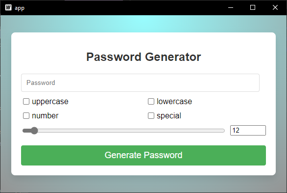
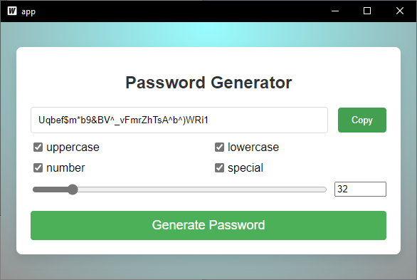

# Password Generator

This application is a simple yet powerful password generator built using Wails and React. It allows the user to generate a password of a specified length, including a mix of uppercase letters, lowercase letters, numbers, and special characters.

## Images




## Prerequisites

Before running this application, you need to ensure that Go, Node.js and npm/yarn are installed on your machine.

* Install [Go](https://golang.org/dl/)
* Install [Node.js](https://nodejs.org/en/download/)
* Install npm/yarn. If you installed Node.js from the above step, npm would have been installed as well. If you wish to use yarn, install it by running `npm install --global yarn`.

Additionally, install Wails by running the following command:

```bash
go install github.com/wailsapp/wails/v2/cmd/wails@latest
````
## Installation

1. Clone the repository
```bash
git clone https://github.com/eestaniel/password_generator2.git
cd password-generator/app
```
## Run the application in development mode
```sh
wails dev
```


## Building the application

```sh
wails build
```

After building the application, you can find the executable in the `build/bin` directory. 
To run the application, navigate to the `build/bin` directory and run the executable file.


## Usage

When you open the application, you will see a form where you can select the types of characters to include in the password and the length of the password. After selecting your preferences, click the "Generate Password" button to generate a password. The generated password will appear in the text box at the top of the form. You can then copy the password to the clipboard by clicking the "Copy" button next to the password.

## Contributing

Pull requests are welcome. For major changes, please open an issue first to discuss what you would like to change.

## License

This project is licensed under the MIT License - see the [LICENSE](LICENSE) file for details
